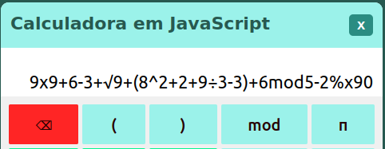
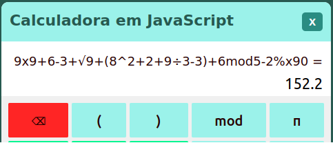

# Calc.js

**Calculadora simples feita em JavaScript**

Nela o usuário pode inserir uma expressão tanto clicando no input e escrevendo pelo teclado quanto usando os botões da calculadora 

**Operações que a calculadora capaz de realizar:**
| Simbolo |     Operação    |
|---------|-----------------|
|    +    |       soma      |
|    -    |    subtração    |
|    x    |  multiplicação  | 
|    ÷    |     divisão     |
|    ^    |   potênciação   | 
|    √    |       raiz      |
|    %    |   porcentagem   |
|   mod   | resto de divisão| 

**Outros botões:**
| Simbolo |       nome      |                            função                            |
|---------|-----------------|--------------------------------------------------------------|
|    ⌫    |      apagar     | Apaga toda a expreção.                                       |
|    =    |      igual      | Resolve a operação e imprime o resultado na tela.            |
|    π    |        pí       | Imprime o valor de pí com 8 casas decimais de precisão.      |
|   ( )   |    parenteses   | Da prioridade de resolução para a operação entre parenteses. | 

**Exemplo de imput:**

**Exemplo de Resultado:**

